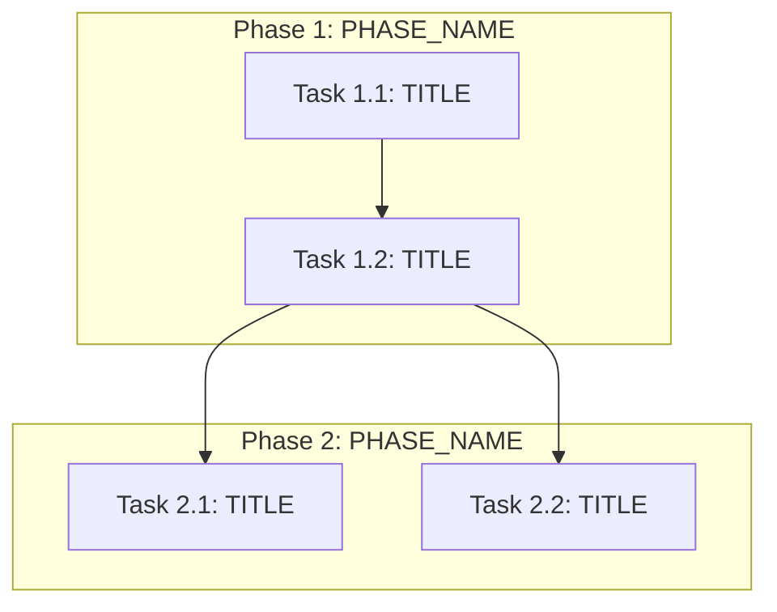

# Execution Backlog

**Feature:** [FEATURE_NAME]
**AgentRoutingMode:** PROVIDED | PROVISIONAL
**ConstitutionVersion:** [CONSTITUTION_LABEL_OR_UNKNOWN]

<!--
  This template is populated by the Sub-Task Creation Agent (Stage 4).
  It produces an ordered execution backlog — NOT source code.

  Inputs consumed:
    - artifacts/specs.md (the "what")
    - artifacts/plan.md (the "how" — phases, contracts, sequencing)
    - artifacts/constitution.md (guardrails)
    - artifacts/repo-assessment.md (file-path facts, reusable assets, risks)
    - agents.md from target repo (the "who" — optional; if absent, use PROVISIONAL routing)

  Input precedence on conflicts:
    1) constitution.md  2) specs.md  3) plan.md  4) repo-assessment.md  5) agents.md
-->

---

## 0. Input Coverage Checklist

<!--
  ACTION REQUIRED: Map every spec goal and plan phase to at least one task.
  This section proves nothing was dropped during decomposition.

  Format: one bullet per spec requirement or plan phase, with the Task IDs
  that cover it. Every FR-xx, SC-xx, and AC-xx from specs.md should appear.
  Every phase from plan.md Section 5 should appear.
-->

- [SPEC_GOAL_OR_PLAN_PHASE]: covered by [TASK_IDS]
<!-- Example: "FR-001 (TrustManager CR singleton enforcement): T1_1, T1_2" -->
<!-- Example: "Plan Phase 3 (Controller reconcile): T3_1, T3_2, T3_3, T3_4" -->
- [SPEC_GOAL_OR_PLAN_PHASE]: covered by [TASK_IDS]

**Complexity scale**: Fibonacci integers — 1 (trivial), 2 (small), 3 (medium), 5 (large), 8 (extra-large, consider splitting).

---

## 1. Task Dependency Graph (Mermaid)

<!--
  ACTION REQUIRED: Produce a Mermaid graph showing execution dependencies.
  Use stable node IDs matching Task IDs in the manifest (T1_1, T1_2, etc.).
  Group tasks into subgraphs by phase from plan.md.

  Constraints:
    - Keep under ~40 nodes. If larger, emit a phase-level summary DAG
      plus a second detail subgraph for the critical path only.
    - Only draw dependency edges where one task MUST complete before
      another can start.
    - Do NOT draw edges for tasks that are merely in the same phase
      but can run in parallel.
-->

---

## 2. Linear Execution Order

<!--
  ACTION REQUIRED: List all Task IDs in a valid topological order.
  This is the fallback execution sequence for engines that do not
  support DAG scheduling. Ties are broken by phase order from plan.md.

  Format: numbered list with Task ID and brief title.
-->

1. T1_1 — [TITLE]
2. T1_2 — [TITLE]
3. T2_1 — [TITLE]
4. T2_2 — [TITLE]

---

## 3. Task Execution Manifest

<!--
  ACTION REQUIRED: Produce a markdown table with EXACT columns below.
  Every task from the DAG must appear here. No extra columns, no missing columns.

  Column definitions:
    Task ID       — Stable ID matching DAG nodes (T1_1, T1_2, ...)
    Task Title    — Short imperative description
    Assigned Agent — Agent ID from agents.md (or provisional ID if PROVISIONAL mode)
    Phase         — Phase name from plan.md Section 5
    Depends On    — Comma-separated Task IDs that must complete first (or "none")
    Parallel OK   — Yes/No; Yes only if this task touches disjoint files from
                    all tasks it could run alongside
    Complexity    — Fibonacci integer (1,2,3,5,8)
    Risk          — Low/Medium/High; High if Evidence: PARTIAL or touches
                    unverified items from repo-assessment.md Section 5.1

  Provisional agent IDs (use when AgentRoutingMode is PROVISIONAL):
    API_Agent, OperatorController_Agent, ManifestsBindata_Agent,
    WebhookTLS_Agent, RBACSecurity_Agent, OLMRelease_Agent,
    Testing_Agent, Docs_Agent
-->

| Task ID | Task Title | Assigned Agent | Phase | Depends On | Parallel OK | Complexity | Risk |
|---------|-----------|---------------|-------|-----------|------------|-----------|------|
| T1_1 | [TITLE] | [AGENT_ID] | [PHASE] | none | No | [1-8] | [Low/Med/High] |
| T1_2 | [TITLE] | [AGENT_ID] | [PHASE] | T1_1 | No | [1-8] | [Low/Med/High] |

---

## 4. Task Specifications (Payloads)

<!--
  ACTION REQUIRED: For EACH Task ID in the manifest, produce a subsection
  below. This is the context payload sent to the assigned execution agent
  when the task is triggered. It must contain enough information for the
  agent to execute the task without re-reading the full plan.

  Per-task fields:
    Objective          — What the task accomplishes (1-2 sentences)
    Target file(s)     — From repo-assessment.md / plan.md only; do NOT invent paths
    Non-goals          — What this task must NOT touch (from constitution + plan guardrails)
    Implementation notes — Non-code constraints, patterns to follow, conventions to match
    Acceptance criteria — Must trace to specs.md IDs (FR-xx, SC-xx, AC-xx)
    Downstream handoff — What artifacts/state the next task expects from this one

  If repo_assessment was PARTIAL and file paths are uncertain, mark
  "Evidence: PARTIAL" and include a discovery step in the objective.
-->

### Task T1_1: [TITLE]

- **Objective:** [WHAT_THIS_TASK_ACCOMPLISHES]
- **Target file(s):** [FILE_PATHS_FROM_REPO_ASSESSMENT_OR_PLAN]
- **Non-goals / forbidden edits:** [WHAT_NOT_TO_TOUCH]
- **Implementation notes:** [NON_CODE_CONSTRAINTS_AND_PATTERNS]
- **Acceptance criteria:** [TRACES_TO_SPECS_MD_IDS]
- **Downstream handoff:** [WHAT_NEXT_TASK_EXPECTS]

---

### Task T1_2: [TITLE]

- **Objective:** [WHAT_THIS_TASK_ACCOMPLISHES]
- **Target file(s):** [FILE_PATHS_FROM_REPO_ASSESSMENT_OR_PLAN]
- **Non-goals / forbidden edits:** [WHAT_NOT_TO_TOUCH]
- **Implementation notes:** [NON_CODE_CONSTRAINTS_AND_PATTERNS]
- **Acceptance criteria:** [TRACES_TO_SPECS_MD_IDS]
- **Downstream handoff:** [WHAT_NEXT_TASK_EXPECTS]

---

<!-- Add more Task subsections as needed, one per Task ID in the manifest -->

---

## 5. Orchestration Notes

<!--
  ACTION REQUIRED: Provide operational guidance for the execution engine
  and human reviewers. This section does NOT contain tasks — it contains
  meta-information about how to safely execute the backlog.
-->

### Retry Boundaries

<!-- Which tasks can be safely retried without side effects, and which
     require cleanup or rollback if they fail mid-execution? -->

- [RETRY_GUIDANCE]

### Merge Conflict Hotspots

<!-- Which files are touched by multiple tasks or are auto-generated
     (e.g., zz_generated.deepcopy.go, bindata/, CRD YAML)? These
     require sequential execution or a post-merge regeneration step. -->

- [HOTSPOT_FILES_AND_MITIGATION]

### Open Questions Requiring SME Before Execution

<!-- Any unresolved items from plan.md Section 8 or repo-assessment.md
     Section 5.1 that must be answered before specific tasks can proceed. -->

- [OPEN_QUESTION]: blocks [TASK_IDS]
